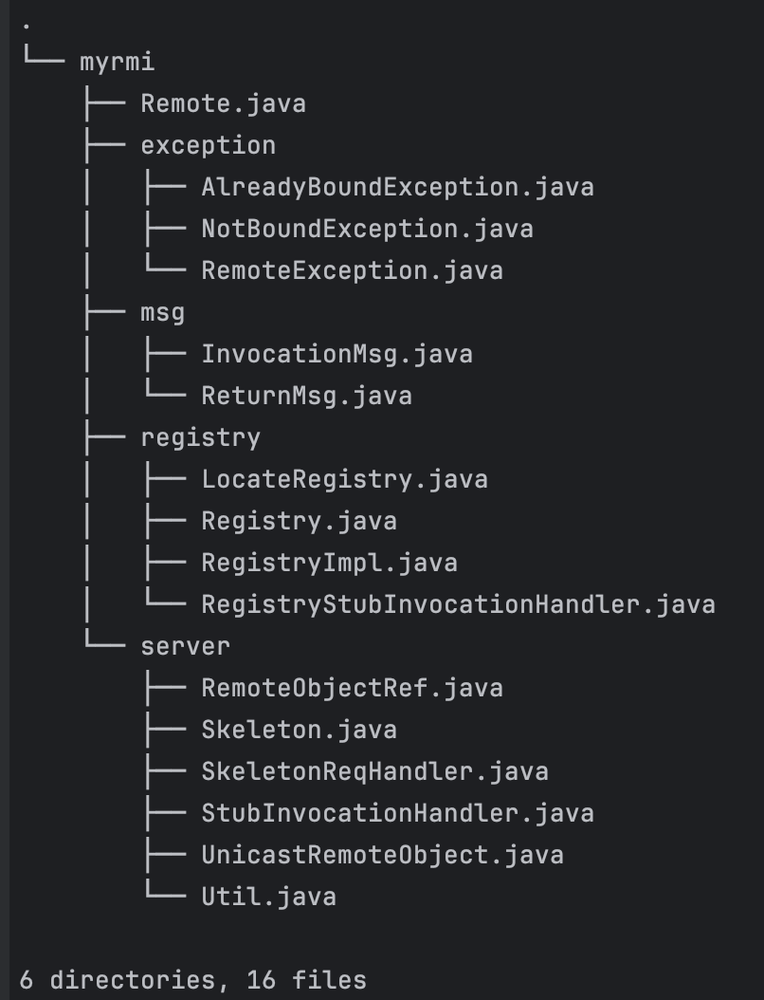
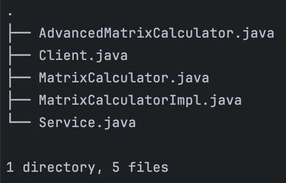
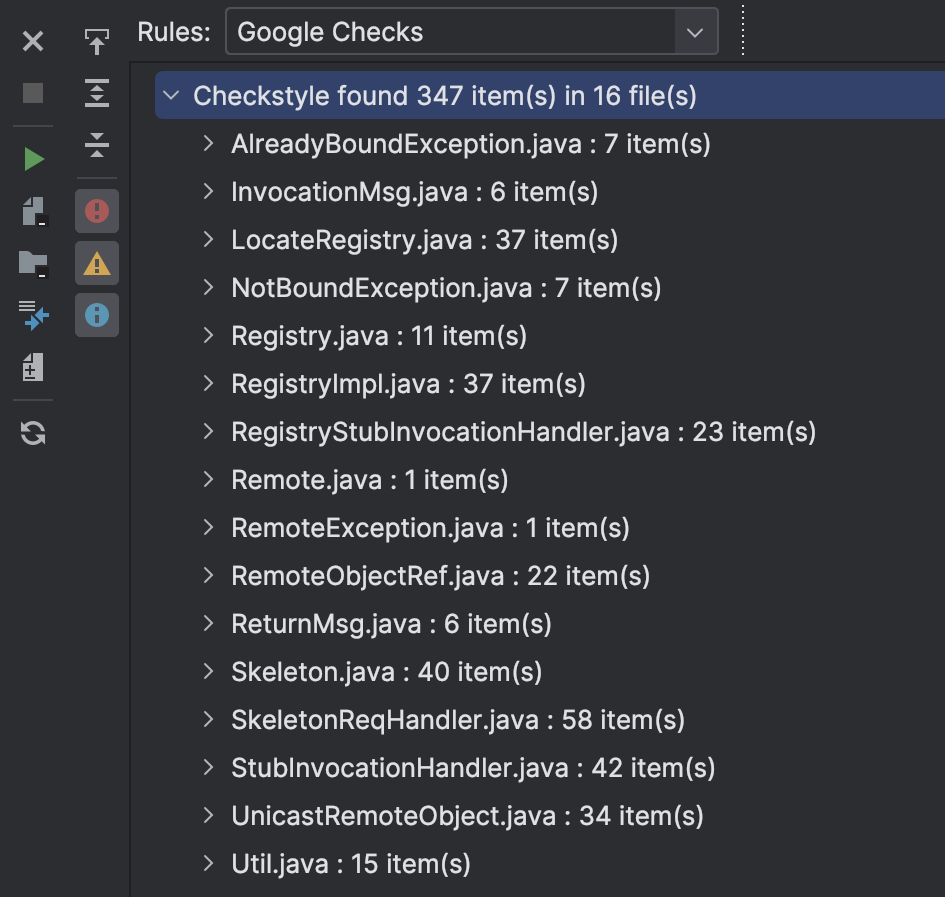
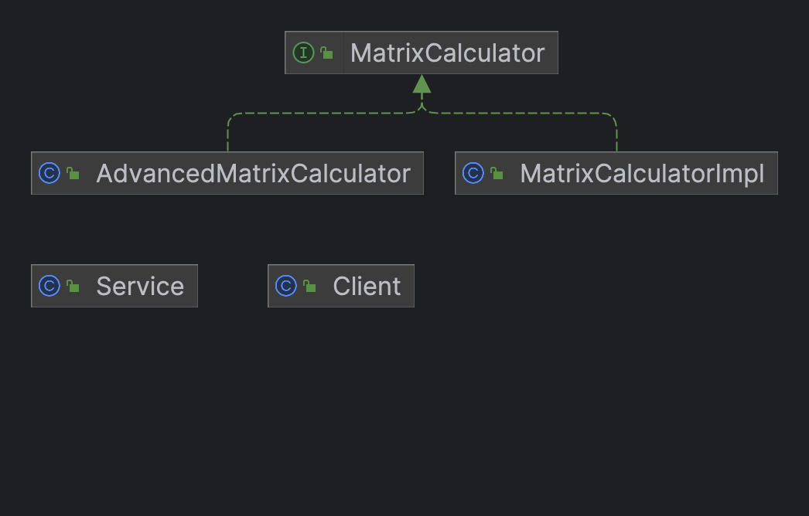
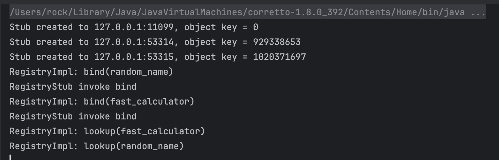
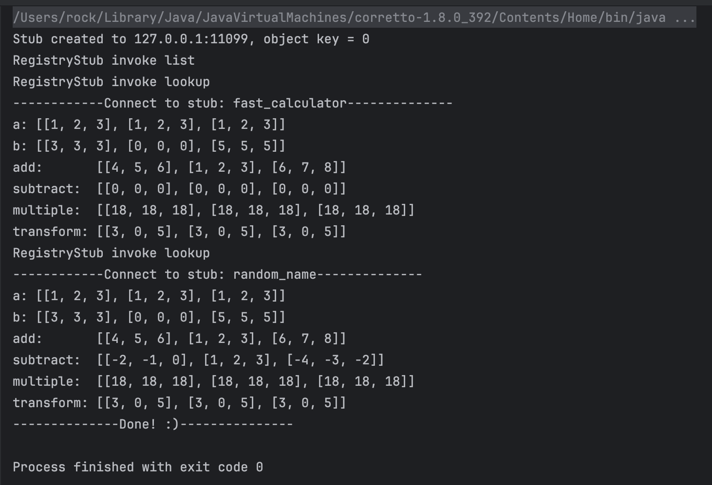

# CS328 Distributed System Assignment 2 Report


**Student Name:** 余坤屹 Yu Kunyi

**Student ID:** 12013027


## 1 Explanation of design

This implement of **RMI (Remote Method Invocation**) is followed by the structure provided by CS328 MyRMI zip file. All *todo* code blocks are finished and a comprehensive testing module can run well.

Following subsections will discuss some details of the implement.


### 1.1 Overall structure

As figures show:

| Java:<br /> | Test:<br /> |
| ------------------------------------------------------------ | ------------------------------------------------------------ |


### 1.2 Serialization

* Relative files: *./msg/InvocationMsg.java ./msgReturnMsy.java*

These two files implements *Serializable* Interface, which could simplify the serialization process when invocation and return results. The codes are very simple due to the usage of Annotations, as follow shows:

*InvocationMsg.java*

```java
@Getter
@Setter
@AllArgsConstructor
public class InvocationMsg implements Serializable {
    private int objectKey;
    private String methodName;
    private Class<?>[] parameterTypes;
    private Object[] args;
}
```

*ReturnMsg.java*

```java
@Getter
@Setter
@NoArgsConstructor
public class ReturnMsg implements Serializable {
    private int objectKey;
    private int status;
    private Object result;
}
```


### 1.3 Stub/skeleton generation and communication

* reletive files: *./server/Skeleton.java ./server/SkeletonReqHandler.java ./server/StubInvocationHandler.java ./server/UnicastRemoteObject.java ./server/Util.java*

* (1) *./server/Skeleton.java* is in the server-side, it is a *Thread* class and  contains a *ThreadPool* to accept new connection in the client-side. Core codes:

  ```java
              InetAddress bindAddr = InetAddress.getByName(getHost());
              ServerSocket server = new ServerSocket(getPort(), BACKLOG, bindAddr);
              setPort(server.getLocalPort());
              while (true) {
                  Socket client = server.accept();
                  threadPool.submit(new SkeletonReqHandler(client, getRemoteObj(), getObjectKey()));
              }
  ```

* (2) *./server/SkeletonReqHandler.java* is a *Thread* class handle remote call from one client, called by *Skeleton* shows as above codes. Core codes:

  ```java
  				ReturnMsg returnMsg = new ReturnMsg();
          returnMsg.setObjectKey(this.objectKey);
          // receive from stub
          try {
              ObjectInputStream in = new ObjectInputStream(socket.getInputStream());
              InvocationMsg invocationMsg = (InvocationMsg) in.readObject();
              objectKey = invocationMsg.getObjectKey();
              methodName = invocationMsg.getMethodName();
              argTypes = invocationMsg.getParameterTypes();
              args = invocationMsg.getArgs();
              Method method = obj.getClass().getDeclaredMethod(methodName, argTypes);
              if (this.objectKey != objectKey) returnMsg.setStatus(-1);  // invocation error
              else {
                  result = method.invoke(obj, args);
                  returnMsg.setResult(result);
                  if (result == null) returnMsg.setStatus(1);  // void method
                  else returnMsg.setStatus(2);  // non-void method
              }
          } catch (...) {...}
          // send to stub
          try (ObjectOutputStream out = new ObjectOutputStream(socket.getOutputStream())) {
              out.writeObject(returnMsg);
              out.flush();
          } catch (...) {...}
  ```

* (3) *./server/StubInvocationHandler.java* is similar to *SkeletonReqHandler* but in the client side. Core codes is similar, not show.

* (4) *./server/UnicastRemoteObject.java* has a static method to *export object*, it will create a skeleton for each object in the server-side and wait to registry to bind which could be acquired by clients. Core codes:

  ```java
          int objectKey = obj.hashCode();
          Skeleton skeleton = new Skeleton(obj, host, port, objectKey);
          skeleton.start();
  					...
          String interfaceName = "Remote";
          if (obj.getClass().getInterfaces().length > 0) interfaceName = obj.getClass().getInterfaces()[0].getName();
          int remotePort = skeleton.getPort();
          RemoteObjectRef ref = new RemoteObjectRef(host, remotePort, objectKey, interfaceName);
          return Util.createStub(ref);
  ```

* (5) *./server/Util.java* contains util methods. not shows specific codes.

  

### 1.4 Registry

* Relitive files: *./registry/LocateRegistry.java ./registry/Registry.java ./registry/RegistryImpl.java ./registry/RegistryStubInvocationHandler.java*

The goal of *registry* is to let clients to find remote object and call method. These files almost finished by original codes, so core codes will not be shown.


### 1.5 Quality of code (comments, naming, etc.)

* General **comments** are contained in the files, such as *// send to stub* and *// recieve from stub*

* All the **names** of variables are named by their usage

* Using *CheckStyle* plugin in the *IDEA IntelliJ*

  items changed from 500+ to 347, still has some indentation error (google ask 2 spaces, not 4 spaces in the *IDEA IntelliJ*)

  

* Manage codes by GitHub: https://github.com/Rock3Yu/CS328_DistributedSys private for now


## 2 Tests

* Tests of your design (with screenshots): use simple client and server codes to show how to use your framework and the execution results.

* Relitive files: *./test/AdvancedMatrixCalculator.java ./test/Client.java ./test/MatrixCalculator.java ./test/MatrixCalculatorImpl.java ./test/Service.java*

  

* **Service** creates two instances (*AdvancedMatrixCalculator* and *MatrixCalculatorImpl*) and unicast by the registry.

* **Client** looks up the remote objects from registry and calls methods.

* Running screenshot:

  | Service Side:</br> | Client Side:</br> |
  | ------------------------------------------------------------ | ------------------------------------------------------------ |

  

## 3 Difficulties and solutions

* Java socket programming is a little bit difficult to me, because I enrolled in Computer Network Course 1 year ago

  Sol: I review some slides and use chatgpt to correct the usage of Socket and ServerSocket

* The overall structure of RMI implement is confusing.

  Sol: I read the documentation of Java RMI, althought the implement of java is different to our codes. And I also find a great website which introduce some basic concepts of Distributed System (https://www.geeksforgeeks.org/distributed-systems-tutorial/?ref=lbp)


## 4 Acknowledged 

Thanks for the help from TA Nan and wish you have a nice day.
