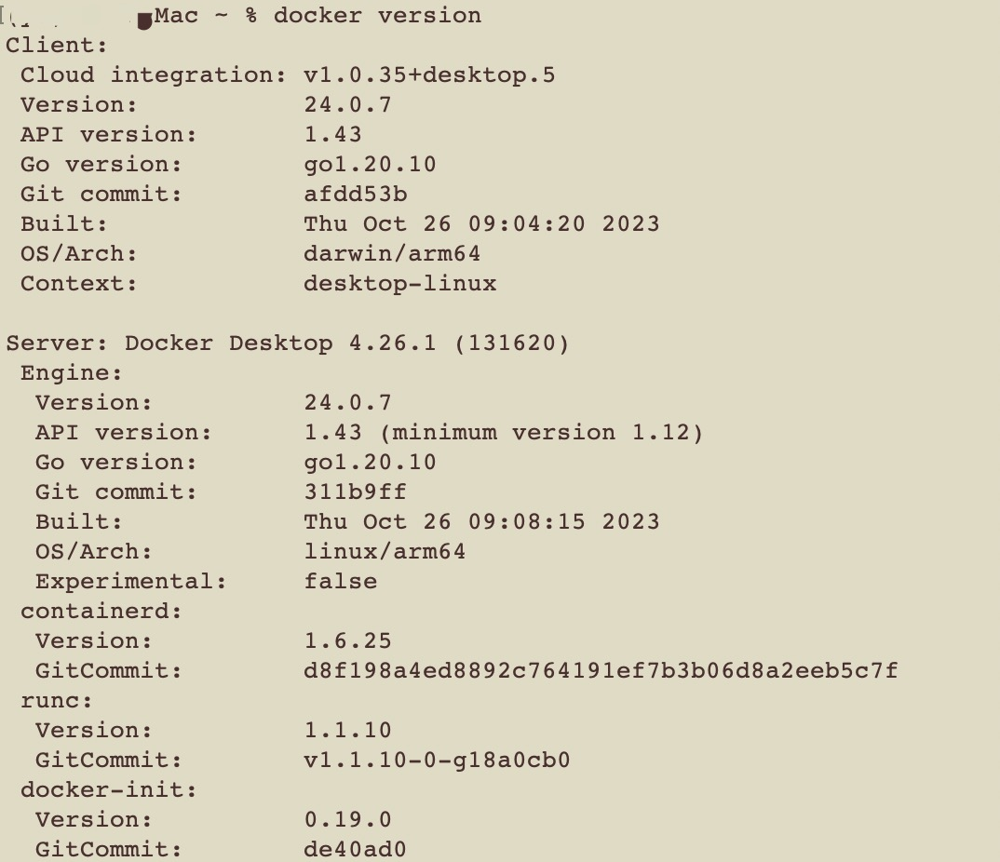
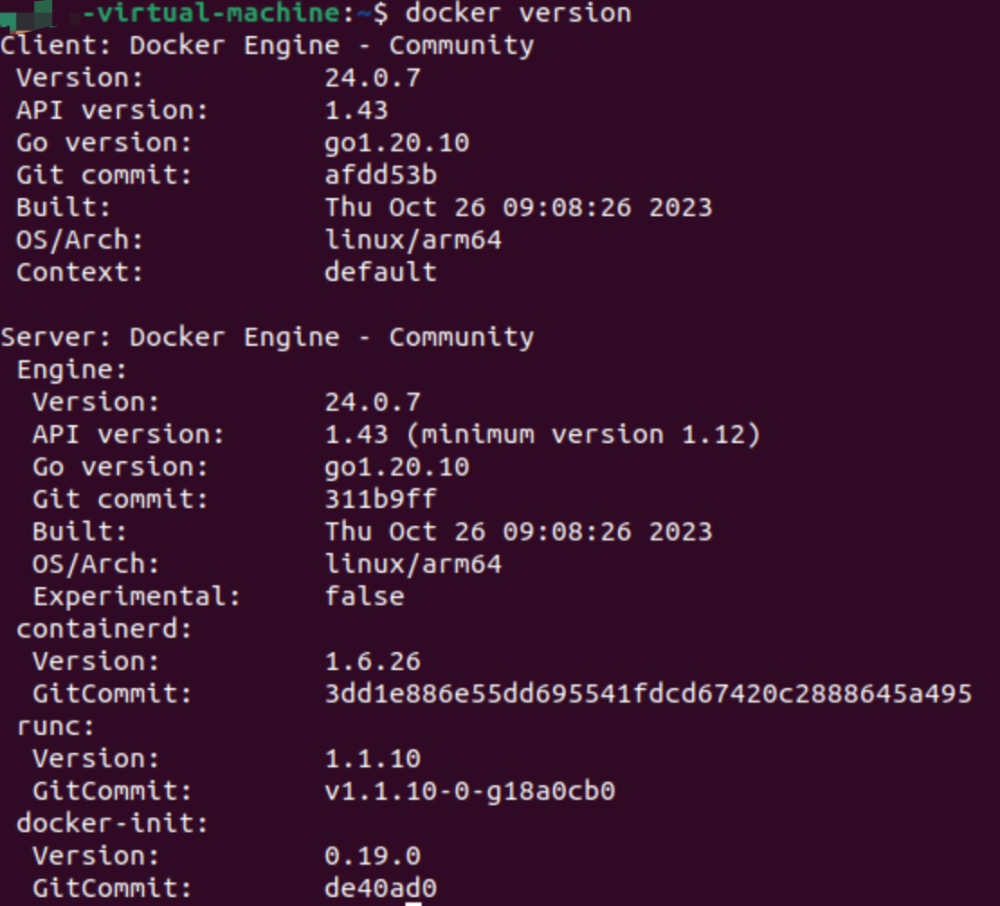

# CS328 Distributed System Assignment 4 Report


**Student Name:** 余坤屹 Yu Kunyi

**Student ID:** 12013027


## 1. The goal of the Assignment 4

Deployment of Assignment 2 by using Docker Hub. "**Dockerfile and Docker Compose**"


## 2. Results

| Development OS | Deployment OS                      |
| -------------- | ---------------------------------- |
| macOS 14.2.1   | Virtual Machine Ubuntu Linux 20.04 |

### 2.1 Result of docker version

| macOS                                                | Linux                                               |
| ---------------------------------------------------- | --------------------------------------------------- |
|  |  |

### 2.2 Result of docker build

Build three times for <u>registry, server, and client</u> by using the same **Dockerfile**, while the **pom.xml** will control the main java file.

* Dockerfile

```Dockerfile
FROM maven:3.8.4-openjdk-11-slim AS build
WORKDIR /usr/src/app
COPY pom.xml .
RUN mvn dependency:go-offline
COPY src/main/java/myrmi src/main/java/myrmi
RUN mvn package

FROM openjdk:8
WORKDIR /usr/app
COPY --from=build /usr/src/app/target/MyRMI_Docker-1.0-SNAPSHOT.jar app.jar
CMD ["java", "-jar", "app.jar"]
```

* pom.xml (part)

```xml
...
            <plugin>
                <groupId>org.apache.maven.plugins</groupId>
                <artifactId>maven-jar-plugin</artifactId>
                <version>3.1.0</version>
                <configuration>
                    <archive>
                        <manifest>
<!--                            <mainClass>myrmi.registry.RegistryMain</mainClass>-->
<!--                            <mainClass>myrmi.server.ServerMain</mainClass>-->
                            <mainClass>myrmi.client.ClientMain</mainClass>
                        </manifest>
                    </archive>
                </configuration>
            </plugin>
...
```

* Result of `docker build -t rock3yu/cs328_a4_client .` (same for registry and server)
  * Usually, the stages 4/6 and 6/6 will cost plenty of time (100~200s)


### 2.3 Result of docker push, which pushes your customized images to the docker hub

* Result of `docker push rock3yu/cs328_a4_client`


### 2.4 Result of running application with docker compose

* docker-compose.yaml

```yaml
version: '3'

services:
  registry:
    image: 'rock3yu/cs328_a4_registry'
    networks:
      - myrmi-net

  server:
    image: 'rock3yu/cs328_a4_server'
    depends_on:
      registry:
        condition: service_started
    networks:
      - myrmi-net
    environment:
      - REGISTRY_HOST=registry
      - SERVER_PORT=9000

  client:
    image: 'rock3yu/cs328_a4_client'
    depends_on:
      registry:
        condition: service_started
      server:
        condition: service_started
    networks:
      - myrmi-net
    environment:
      - REGISTRY_HOST=registry

networks:
  myrmi-net:
    driver: bridge

```

* Result of running on VM Ubuntu (same result running on macOS)
  * docker-copose.yaml in a random directory
  * Manual termination (ctrl+c) of *<font color='dark'>registry</font>, <font color='green'>server</font>, and <font color='lit blue'>client</font>* exited with code 0


### 2.5 Result of docker ps -a when the server and registry are running


### 2.6 Result of successfully running remote method invocation from the client

* image same to 2.4
* the output of *<font color='dark'>registry</font>, <font color='green'>server</font>, and <font color='lit blue'>client</font>* is as expected


## 3. Link to the published docker images on Docker Hub

https://hub.docker.com/repository/docker/rock3yu/cs328_a4_registry

https://hub.docker.com/repository/docker/rock3yu/cs328_a4_server

https://hub.docker.com/repository/docker/rock3yu/cs328_a4_client
