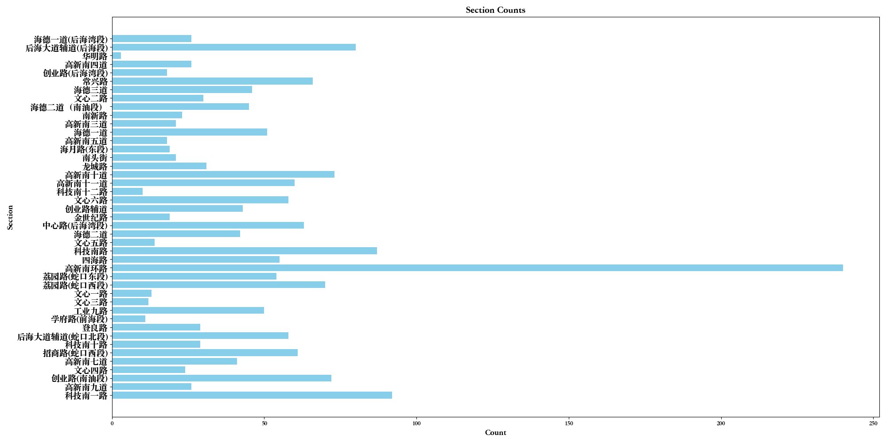

# CS328 Distributed System Assignment 3 Report


**Student Name:** 余坤屹 Yu Kunyi

**Student ID:** 12013027


## Overview

The implement of assignment 3 uses **Python** as the programming language, **Spark DataFrame** as the data processing tool, without running on a cluster. 

**This section** is the overview of whole assignment. Furthermore, **Next 5 sections** will discuss task (1)~(5) separately, which include the important part of source code, the sample of results, Spark job’s DAG, and ploting some figures. Last but not least, **the last section** will discuss the difficulties and lessons I learnt. 

### The structure of the implement


### Preprocessing methos

```python
# some import ...

spark = SparkSession.builder.appName("MySpark").getOrCreate()
df = spark.read.csv(file_path, header=True)

df = df \
    .filter(col("in_time") < col("out_time")) \
    .dropDuplicates(["out_time", "in_time", "berthage"]) \
    .na.drop()
df = df \
    .withColumn("berthage", col("berthage").cast("int")) \
    .withColumn("in_time_unix", unix_timestamp("in_time", "yyyy-MM-dd HH:mm:ss")) \
    .withColumn("out_time_unix", unix_timestamp("out_time", "yyyy-MM-dd HH:mm:ss")) \
    .withColumn("parking_time", col("out_time_unix") - col("in_time_unix"))
df = df.drop("out_time_unix").drop("in_time_unix")  # task 1-5 will not change it but use it
```

* Remove some invalid, duplicated, and N/A rows. 
  * Result: num(row): 1,048,001 -> 970,925
* Convert "berthage" to int
* Add column "parking_time" to convenience task 1-5

### The Summary of Spark jobs


## Task 1: total number of berthages in each section

Requirement: Output the total number of berthages in each section. The output file should have two columns, with the headers being section and count.

### 1.1 Source code

```python
result_df = df \
    .groupBy("section") \
    .agg(F.countDistinct("berthage").alias("count"))
# then show and store the result
```

### 1.2 Result sample


<center>43 rows in total</center>

### 1.3 Spark job’s DAG


### 1.4 Figure




## Task 2: all unique ids (berthages) with their sections

Requirement: Output all unique ids (berthages), associated with their sections. The output file should have two columns, with the headers being berthage and section.

### 2.1 Source code

```python
result_df = df \
    .select("berthage", "section") \
    .distinct()
# then show and store the result
```

### 2.2 Result sample


<center>1,930 rows in total</center>

### 2.3 Spark job’s DAG


## Task 3: average parking time per section

Requirement: Output for each section:the average parking time of a car in that section.The output file should have two columns, with the headers being section and avg_parking_time. The average parking time should be counted in seconds as an integer.

### 3.1 Source code

```python
result_df = df \
    .groupBy("section") \
    .agg(F.avg("parking_time").cast("int").alias("avg_parking_time"))
# then show and store the result
```

### 3.2 Result sample


<center>43 rows in total</center>

### 3.3 Spark job’s DAG


### 3.4 Figure


## Task4: Average parking time per berthage, in descending order

Requirement: Output the average parking time for each berthage, sorted in descending order. The output file should have two columns, with the headers being berthage and avg_parking_time. The average parking time should be counted in seconds as an integer.

### 4.1 Source code

```python
result_df = df \
    .groupby("berthage") \
    .agg(F.avg("parking_time").cast("int").alias("avg_parking_time"))
result_df = result_df.orderBy(desc(result_df.avg_parking_time))
# then show and store the result
```

### 4.2 Result sample


<center>1,930 rows in total</center>

### 4.3 Spark job’s DAG


## Task 5: Berthage usage per section, hour

Requirement: Output for each section: the total number of berthages in use (“in use” means there is at least one car in that berthage) and the percentage out of the total number of berthages in that section, in a one-hour interval (e.g. during 09:00:00-10:00:00). The output file should have five columns, with the headers being start_time, end_time, section, count and percentage. The percentage value should be rounded to one decimal place (e.g. 67.8%). The data format of start_time and end_time should be “YYYY-MM-DD HH:MM:SS”, e.g. 2018-09-01 12:00:00

### 5.1 Source code

```python
# _map_time_scope() method, str -> [str*n] mapping
spark.udf.register("map_time_scope_udf", _map_time_scope, ArrayType(StringType()))

count_df = df.groupBy("section").agg(F.countDistinct("berthage").alias("berthage_count"))

tmp = df.select("section",
                explode(expr("map_time_scope_udf(in_time, out_time)")).alias("time_scope"),
                "berthage")
result_df = tmp \
    .groupby("section", "time_scope") \
    .agg(F.countDistinct("berthage").alias("count")) \
    .join(count_df, "section")

result_df = result_df \
    .withColumn("percentage", round((col("count") / col("berthage_count")) * 100, 1)) \
    .drop("berthage_count") \
    .withColumn("start_time", col("time_scope").substr(0, 8)) \
    .withColumn("end_time", col("time_scope").substr(10, 8)) \
    .drop("time_scope")
# then show and store the result
```

### 5.2 Result sample


<center>602 rows in total</center>

### 5.3 Spark job’s DAG


### 5.4 Figure


* Interesting fundings:
  * 创业路（南油段）is the section with highest berthage occupied ratio among these 3. Even at morning and evening, 创业路（南油段）'s parking lots are hard to find. Maybe it is a residential area instead of office are.
  * Although both 高新南环路 and 科技南一路 contains high-tech enterprices, the density of 高新南环路's enterprices and average work intensity may be higher than 科技南一路's.


## Difficulties and lessons

* Although it is very similar to Java Stream programming, the syntax of the Dataframe in Python Spark is different, which needs to be learnt in the documentation.
* Because Spark programming is also *lazy*, the advantage is that speed can be optimized, and the disadvantage is that the intermediate process may produce variables that lead to results that are not expected.
* Generally speaking, the difficulty of this assignment is moderate and I am quite accustomed to it.


* Thanks for the help from TA Nan and wish you have a nice day : )
